<a href="https://ediz-balakchiev.vercel.app">
  <picture>
    <source media="(prefers-color-scheme: dark)" srcset="banner-dark.svg">
    
  </picture>
</a>

      

## About me

Hi, I'm Ediz. Online most people know me as Viper.

I'm a high school student and a self-taught developer. I learn by building real things: websites for small businesses through VIPERNET, and my own web app, RPForge. Now I'm looking for an internship or a junior front-end role where I can grow with an experienced team.

## What I'm building

<table>
  <tr>
    <td width="50%" valign="top">
      <h3><a href="https://rpforge.co">RPForge</a></h3>
      
An AI tool for FiveM/GTA roleplay server developers. React front-end on Vercel, FastAPI and PostgreSQL back-end on Render and prepaid credits with Stripe.

      
   

    </td>
    <td width="50%" valign="top">
      <h3>VIPERNET</h3>
      
Websites for local businesses in Bulgaria, from the first draft to a live site. Responsive layouts, scroll animations and deploys to Vercel.

      
   

    </td>
  </tr>
</table>

## Client sites

| Site | Link |
|:--|:--|
| BGOil | [bgoil.bg](https://bgoil.bg/) |
| Avera EOOD | [averaeood.bg](https://www.averaeood.bg/) |

## What I use

**Front-end** 
       

**Back-end** 
   

**Tools** 
     

 

Open to internships and junior roles. The fastest way to reach me is <a href="mailto:balakchiev09@gmail.com">balakchiev09@gmail.com</a>.

